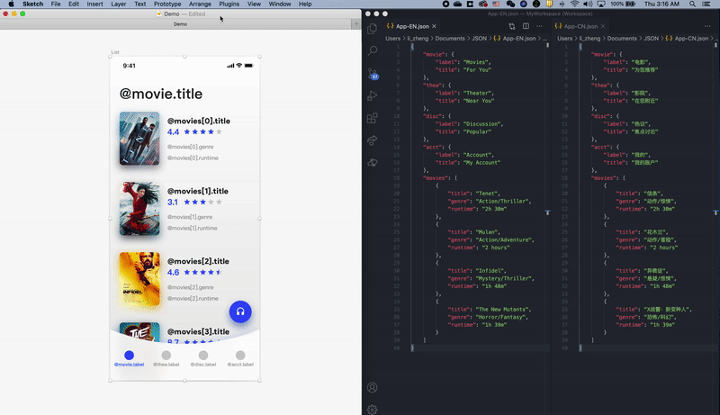
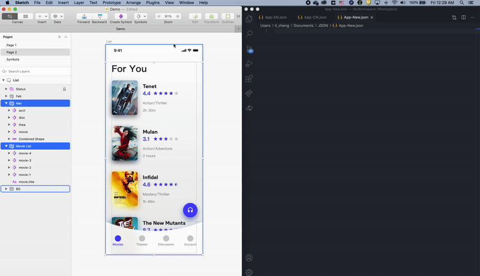
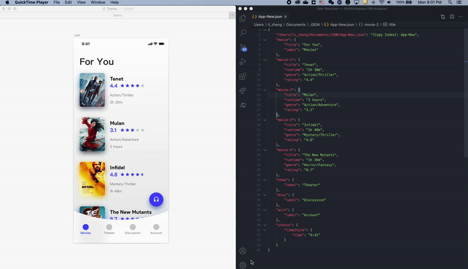
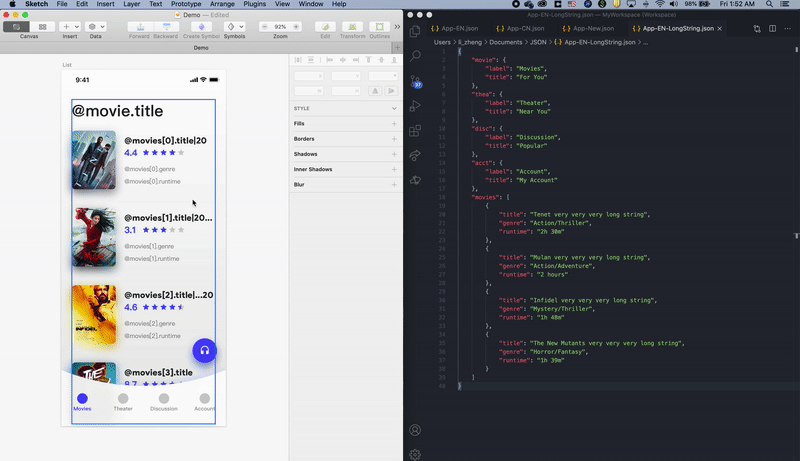

# Copy-Updater

A Sketch plugin that updates copy based on selected JSON

## Installation

-   [Download](../../releases/latest/download/copy-updater.sketchplugin.zip) the latest release of the plugin
-   Un-zip
-   Double-click on copy-updater.sketchplugin

## How to use

### 1. Link & Pull

Use @ to assign a key. The corresponding value will be retrieved after an update.

```
For text: use @your_key as content
For symbol and nested symbol: use @your_key as its override value
```



### 2. Generate & Push

You can either generate a JSON file from selected elements or push updated texts to a linked JSON.



### 3. Check

Use Check to scan every editable text area, compares them with the linked JSON file, and list all unsynced strings for you to decide to pull or push.



### 4. Truncation

Use | to specify character count

-   |n: Truncate text into n number of characters
-   |n...: Truncate text into n number of characters and add ... at the end
-   |...n: Truncate text into n number of characters and add ... in the middle

```
@your_key|20
@your_key|20...
@your_key|...20
```



### Remove key

use -@ to remove a key

The new_value will be used as its text and the old @your_key will be removed.

```
For text: use -@new_value as content
For symbol and nested symbol: use -@new_value as its override value
```

## Examples:

JSON

```json
{
    "header": "This is a header",
    "intro1": {
        "title": "Intro 1",
        "body": "This is body copy for intro 1"
    },
    "intro2": {
        "title": "Intro 2",
        "body": "This is body copy for intro 2"
    }
}
```

Sketch File

```
Textlayer (text): @header
Intro Symbol 1 (override value): @intro1.title, @intro1.body|20...
Intro Symbol 2 (override value): @intro2.title, @intro2.body|...20
```

On The Screen

```
This is a header
Intro1
This is body copy fo...
Intro2
This is bo...or intro 2
```
